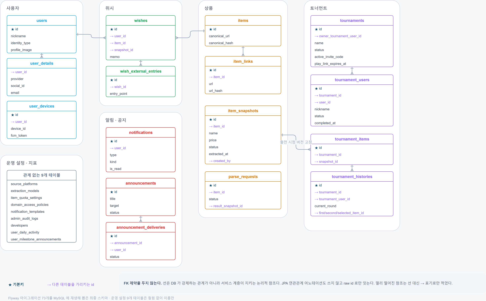
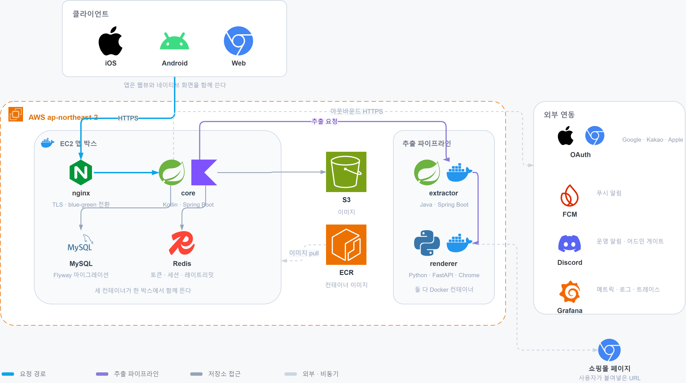
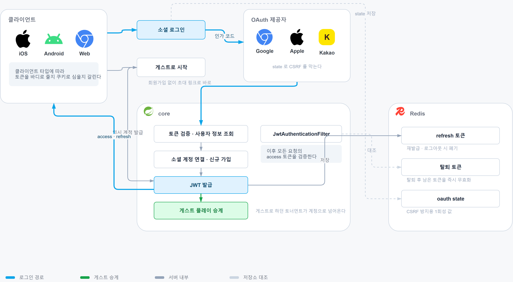
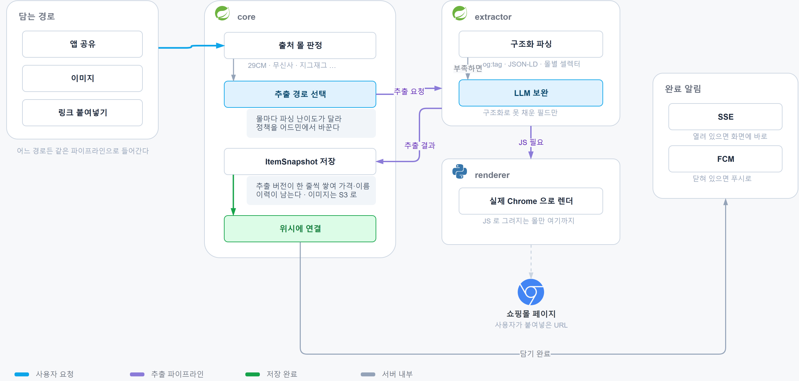
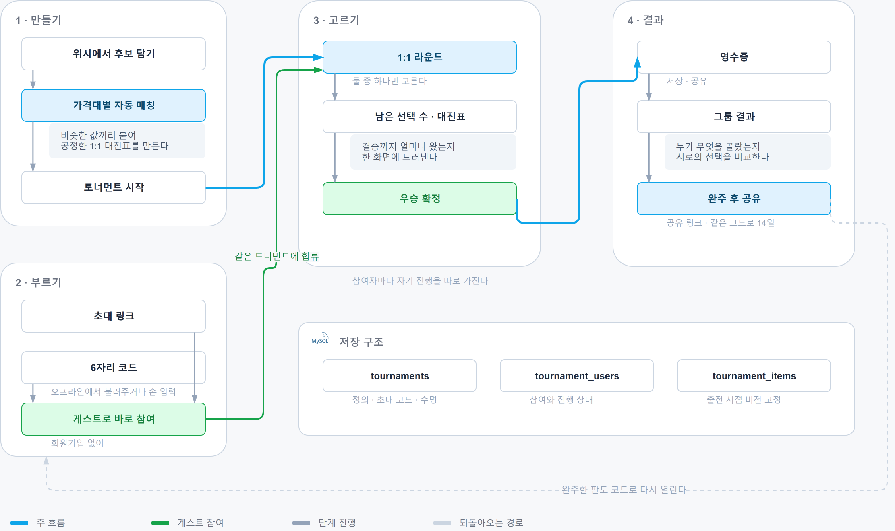
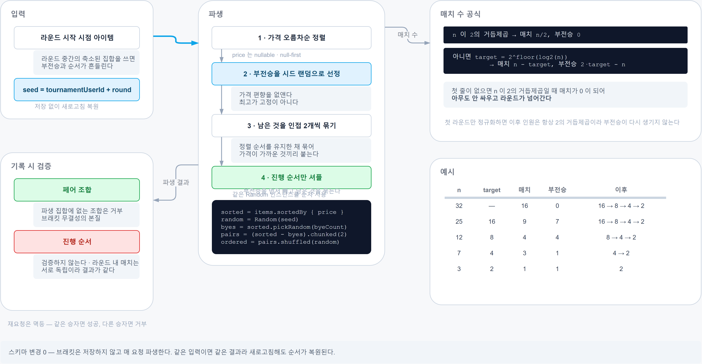
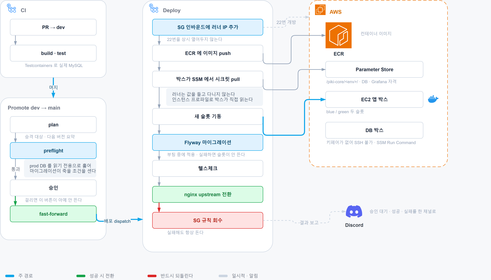

# PiKi · core

> **Saved a lot, bought nothing?**

쌓아둔 위시템을 토너먼트로 비교해 **직접 결정**하게 돕는 서비스, PiKi 의 백엔드 API 서버입니다.

위시리스트 · 토너먼트 · 사용자를 소유하고, 상품 추출 파이프라인을 오케스트레이션합니다.

<a href="https://apps.apple.com/kr/app/piki-%EA%B0%99%EC%9D%B4-%EA%B3%A0%EB%A5%B4%EB%8A%94-%EC%87%BC%ED%95%91-%ED%86%A0%EB%84%88%EB%A8%BC%ED%8A%B8/id6777101805">
  
</a>
<a href="https://play.google.com/store/apps/details?id=day.no30s.piki">
  
</a>


## 목차

1. [서비스 소개](#서비스-소개)
2. [주요 기능](#주요-기능)
3. [시스템 구성](#시스템-구성)
4. [기술 스택](#기술-스택)
5. [레포 구성](#레포-구성)
6. [데이터 모델](#데이터-모델)
7. [시스템 아키텍처](#시스템-아키텍처)
8. [인증](#인증)
9. [위시 등록과 상품 추출](#위시-등록과-상품-추출)
10. [토너먼트](#토너먼트)
11. [배포 자동화](#배포-자동화)
12. [백오피스](#백오피스)
13. [팀 소개](#팀-소개)

## 서비스 소개

**모아서.** 29CM · 무신사 · 지그재그 어디서 발견했든 원하는 상품을 한곳에 모읍니다. 링크를 붙여넣으면 상품명 · 가격 · 이미지가 자동으로 채워집니다.

**비교해서.** 모인 후보를 비슷한 가격대끼리 1:1 토너먼트로 붙입니다. 고민은 짧게, 선택은 둘 중 하나만. 라운드가 올라갈수록 취향이 선명해집니다.

**함께.** 친구를 초대해 같이 담고, 대신 골라주고, 모은 후보를 토너먼트째 선물합니다. 초대 링크 하나면 **회원가입 없이** 바로 참여할 수 있습니다.

## 주요 기능

### 1 · 위시템 가져오기

앱 공유 · 이미지 · 링크 세 경로로 상품을 담습니다. 어느 경로든 서버가 같은 추출 파이프라인으로 보냅니다.

| 앱 공유로 가져오기 | 이미지로 가져오기 | 링크로 가져오기 |
| :---: | :---: | :---: |
|  |  |  |

### 2 · 친구 초대하기

링크와 6자리 초대 코드로 친구를 부릅니다. 받은 사람은 **게스트로 바로 참여**하고, 나중에 로그인하면 그동안의 플레이가 계정으로 승계됩니다.


### 3 · 토너먼트로 고르기

시작 전에 담긴 후보를 **비슷한 가격대끼리 자동 매칭**해 공정한 1:1 대진표를 만듭니다. 남은 선택 수와 대진표를 함께 보여줘 결승까지 얼마나 왔는지 드러냅니다.


### 4 · 결과 저장·공유하기

결과를 **영수증 형태로** 저장하고 공유합니다. 친구도 같은 토너먼트에 참여해 서로의 선택을 비교할 수 있습니다.


## 시스템 구성

| repo | 역할 | 스택 |
|---|---|---|
| [client](https://github.com/TeamPiKi/client) | 앱 클라이언트 (iOS · Android · Web) | |
| **core** (이 repo) | 백엔드 API 서버 · 백오피스 | Kotlin · Spring Boot · MySQL · Redis |
| [extractor](https://github.com/TeamPiKi/extractor) | 상품 추출 서비스. URL 을 fetch·구조화 파싱하고 LLM 으로 보완 | Java · Spring Boot · Gemini |
| renderer <sup>private</sup> | JS 로 그려지는 페이지를 실제 브라우저로 렌더 | Python · FastAPI · Chrome |
| [infra](https://github.com/TeamPiKi/infra) | 여러 repo 에 걸치는 공통 자산의 SSOT (배포 블록 · 개발 규약) | Bash · Protobuf |

호출 흐름은 `client → core → extractor → renderer` 입니다.

## 기술 스택

버전은 박지 않습니다. 단일 진실 원천은 [`build.gradle.kts`](build.gradle.kts) 입니다.

**Language & Framework**

<p>
  
  
  
  
</p>

**Database**

<p>
  
  
  
  
</p>

**Infra & Deploy**

<p>
  
  
  
  
  
</p>

**API · 알림 · 관측**

<p>
  
  
  
  
  
  
</p>

**Test**

<p>
  
  
  
</p>

## 레포 구성

### core

```
📦 com.depromeet.piki
 ┃
 ┣ 📂 auth ──────────────── OAuth · JWT · 게스트 · 토큰 저장소
 ┃  ┣ 📂 infrastructure
 ┃  ┃  ┣ 📂 google · kakao · apple
 ┃  ┃  ┗ 📂 redis ───────── refresh · withdrawn · oauth-state
 ┃  ┣ 📂 filter ─────────── JwtAuthenticationFilter
 ┃  ┗ 📂 web ────────────── 쿠키 · 클라이언트 타입
 ┃
 ┣ 📂 user ──────────────── 계정 · 프로필 · 탈퇴
 ┣ 📂 wishlist ──────────── 위시 담기 · 목록 · 정리
 ┣ 📂 item ──────────────── 상품 정체성과 버전(ItemSnapshot)
 ┣ 📂 product ───────────── 외부 상품 · 추출 파이프라인
 ┃  ┣ 📂 source ─────────── 출처 몰 판정
 ┃  ┗ 📂 routing ────────── 추출 경로 선택
 ┃
 ┣ 📂 tournament ────────── 대진 · 플레이 · 초대 · 결과
 ┃  ┣ 📂 event ──────────── 도메인 이벤트
 ┃  ┗ 📂 migration ──────── 데이터 이행 백필
 ┃
 ┣ 📂 notification ──────── 푸시 · 인앱 · SSE
 ┃  ┣ 📂 fcm
 ┃  ┗ 📂 sse
 ┃
 ┣ 📂 image ─────────────── 업로드 · presigned URL
 ┣ 📂 announcement ──────── 공지
 ┣ 📂 metrics ───────────── 활동 · 등록 · 마일스톤 · 리포트
 ┣ 📂 admin ─────────────── 백오피스 (Thymeleaf SSR)
 ┗ 📂 common ────────────── 응답 래퍼 · 예외 · 이벤트 · 레이트리밋 · 스토리지
```

**도메인 용어를 코드와 문서에서 같게 씁니다.** `item` 은 상품의 정체성이고, 추출값·상태·이력은 버전(`ItemSnapshot`)이 듭니다. `wish` 는 user 가 item 을 담은 기록이고, `tournament_item` 은 출전 시점의 버전을 고정해 가리킵니다. 외부 경계를 가리키는 이름에 `item` 을, 우리 엔티티에 `product` 를 쓰지 않습니다.

**테이블 간 FK 제약과 JPA 연관관계 어노테이션을 두지 않습니다.** 관계는 raw ID 로만 잇고 참조 무결성은 서비스 계층이 책임집니다.


### extractor

```
📦 com.depromeet.piki.extractor
 ┃
 ┣ 📂 api ───────────────── 추출 요청 · 모델 점검 엔드포인트 (core 전용)
 ┣ 📂 extraction ────────── URL 추출 파이프라인
 ┃  ┣ 📂 http ───────────── 페이지 fetch · 내부 주소 차단(SSRF)
 ┃  ┣ 📂 headless ───────── renderer 호출 · 응답 압축 해제
 ┃  ┣ 📂 structured ─────── JSON-LD · OpenGraph 파싱
 ┃  ┗ 📂 gemini ─────────── 구조화로 못 채운 필드만 LLM 보완
 ┃
 ┣ 📂 image ─────────────── 상품 이미지에서 추출 · 상품 영역 크롭
 ┣ 📂 probe ─────────────── LLM 모델 가용성 점검
 ┣ 📂 domain ────────────── ProductLink · ProductSnapshot
 ┗ 📂 common ────────────── 설정 · 예외 · S3 스토리지
```

### renderer

비공개 레포라 구조는 싣지 않습니다. extractor 가 넘긴 URL 을 실제 Chrome 으로 끝까지 렌더해 HTML 을 돌려주는 데까지가 renderer 의 몫이고, 그 HTML 에서 상품 정보를 뽑는 건 extractor 가 합니다.

### infra

```
📦 infra
 ┃
 ┣ 📂 blocks ────────────── 배포 블록 (슬롯 결정 · 컨테이너 실행 · 헬스체크 · 트래픽 전환)
 ┣ 📂 contracts ─────────── 서비스 간 계약 (추출 API proto · 에러 코드 · 헬스체크)
 ┣ 📂 conventions ───────── 공통 규약 (인프라 · 테스트 · 작성)
 ┣ 📂 skills ────────────── 커밋 · PR · 이슈 스킬 정본
 ┣ 📂 hooks ─────────────── git hooks
 ┗ 📄 install.sh ────────── 규약 · 스킬을 각 레포에 설치
```

세 서비스의 배포는 같은 블록을 서로 다르게 조합한 것입니다. core 가 전체 세트를 쓰고, extractor 와 renderer 는 그 일부만 씁니다. 두 레포 이상이 쓰면서 복제하면 어긋나는 자산만 이 레포에 둡니다.

## 데이터 모델



스키마의 정본은 Flyway 마이그레이션입니다. 위 ERD 는 그 마이그레이션 73 개를 실제 MySQL 에 순서대로 재생해 뽑은 최종 상태입니다 — 손으로 그린 그림이 아니라서 코드와 어긋나지 않습니다.

**★ 는 기본키, → 는 다른 테이블을 가리키는 raw ID 입니다.** FK 제약이 없으므로 선은 DB 가 강제하는 관계가 아니라 서비스 계층이 지키는 논리적 참조입니다. 멀리 떨어진 참조는 선을 긋지 않고 → 표기로만 남겨 그림이 읽히게 뒀습니다.

**운영 설정 9 개 테이블은 컬럼 없이 이름만 적었습니다** — 출처 몰 · 추출 모델 · 도메인 접근 정책 · 쿼터 · 알림 템플릿 · 감사 로그 · 활동 지표처럼 다른 테이블과 관계가 없는 테이블입니다.

## 시스템 아키텍처



## 인증



Google · Kakao · Apple 세 제공자와 **게스트** 를 함께 받습니다. 게스트는 회원가입 없이 초대 링크로 바로 참여하고, 나중에 로그인하면 **그동안의 플레이가 계정으로 승계**됩니다.

토큰은 Redis 가 셋으로 나눠 듭니다 — 재발급용 refresh, 탈퇴 후 남은 토큰을 즉시 무효화하는 목록, CSRF 를 막는 1회성 oauth state 입니다.

클라이언트 타입에 따라 **토큰을 바디로 줄지 쿠키로 심을지** 갈립니다.

## 위시 등록과 상품 추출



앱 공유 · 이미지 · 링크 어느 경로로 들어와도 같은 파이프라인을 탑니다. core 가 출처 몰을 판정해 추출 경로를 정하고, extractor 가 구조화 파싱으로 채우다 **부족한 필드만 LLM 으로 보완**합니다. JS 로 그려지는 몰은 renderer 까지 갑니다.

추출 결과는 덮어쓰지 않고 **버전(`ItemSnapshot`)으로 한 줄씩 쌓여** 가격·이름 이력이 남습니다.

외부 호출은 트랜잭션 밖에서 끝냅니다. read-timeout 이 긴 추출을 트랜잭션 안에 넣으면 그동안 DB 커넥션을 잡아 다른 API 까지 느려지기 때문입니다.

## 토너먼트



시작 전에 후보를 **비슷한 가격대끼리 자동 매칭**해 공정한 1:1 대진표를 만듭니다. 링크와 6자리 코드 둘 다 같은 판으로 들어오고, 받은 사람은 게스트로 바로 참여합니다.

**참여자마다 자기 진행을 따로 가집니다.** 정의(`tournaments`)와 진행(`tournament_users`)을 나눠, 한 토너먼트에 여러 사람이 각자의 속도로 붙을 수 있습니다.

완주한 판은 같은 코드로 다시 열립니다 — 결과를 받은 친구가 그 자리에서 자기 판을 시작합니다.

### 대진표를 저장하지 않습니다



대진표는 테이블에 없습니다. **참여자 ID 와 라운드 번호로 만든 seed** 로 매번 같은 순서를 다시 계산합니다. 새로고침해도 순서가 그대로 복원되고, 스키마는 한 줄도 늘지 않았습니다.

가격순으로 정렬해 인접한 것끼리 묶으므로 **비슷한 가격대끼리 붙습니다.** 인원이 2 의 거듭제곱이 아니면 부족한 만큼 부전승을 두는데, 그 부전승은 최고가 고정이 아니라 **시드 랜덤으로 뽑아** 가격 편향을 없앴습니다.

기록할 때는 페어 조합만 검증합니다. 라운드 안의 매치는 서로 독립이라 진행 순서가 달라도 결과가 같기 때문입니다. 같은 매치를 다시 보내면 **같은 승자면 성공, 다른 승자면 거부**합니다.

## 배포 자동화



`dev` 로 머지되면 자동 배포되고, prod 는 `Promote` 워크플로가 `dev` 커밋을 `main` 으로 **fast-forward 승격**합니다. ff 전용이라 두 브랜치 SHA 가 항상 정렬되고 squash·분기 사고가 구조적으로 막힙니다. semver 태그와 릴리즈는 **배포 성공 후에만** 생성됩니다 — 안 뜬 버전에 태그를 박지 않기 위해서입니다.

### 일회성 포트 개방

배포하는 동안에만 **러너 IP 를 보안 그룹 인바운드에 넣었다가 회수**합니다. 22번을 상시 열어두지 않아, 평소에는 어느 IP 에서도 SSH 가 닫혀 있습니다. 배포가 중간에 실패해도 회수 스텝이 `always()` 로 돌아 규칙이 남지 않습니다.

### 시크릿은 SSM 이 소유

앱 런타임 시크릿을 GitHub Secrets 가 아니라 **Parameter Store(`/piki-core/<env>/`)** 에 둡니다. 러너가 값을 들고 다니지 않고 **박스가 인스턴스 프로파일로 직접 pull** 하므로, 유출면이 러너에서 사라집니다. DB 자격·Grafana 자격도 같은 방식입니다.

프로비저닝도 SSM Run Command 로 합니다. DB 박스는 키페어가 없어 SSH 가 아예 불가능하고, 대신 **keyless 로 명령을 보냅니다.**

### 마이그레이션 안전장치

스키마 변경은 **Flyway** 가 앱 부팅 중에 적용합니다. FK 제약을 두지 않고 파괴적 변경은 단계 배포(add → 양쪽 호환 → remove)로 나눕니다.

승격 앞에는 **프리플라이트**가 섭니다. prod DB 를 읽기 전용으로 훑어 마이그레이션이 죽을 조건 — 실패한 마이그레이션 잔재, 백필이 처리 못 할 데이터 — 을 미리 세고, 걸리면 **승인 버튼 자체가 뜨지 않습니다.** 승인 직후 ff 앞에서 한 번 더 돌아, 승인을 기다리는 동안 데이터가 바뀐 경우도 잡습니다.

결과는 Step Summary 와 Discord 로 함께 갑니다. 승인자는 Actions 를 열기 전에 "승인해도 되는가" 를 손에 쥡니다.

### blue-green

새 슬롯을 띄워 헬스체크를 통과한 뒤에 nginx upstream 을 바꿉니다. 실패하면 이전 슬롯이 그대로 서빙하고 새 슬롯만 정리됩니다.

최신 변경사항은 [릴리즈 노트](https://github.com/TeamPiKi/core/releases/latest)에서 확인합니다.

## 백오피스

운영에 필요한 화면을 서버가 Thymeleaf 로 직접 서빙합니다. 별도 프론트 배포 없이 API 서버 하나로 끝납니다.

공지 · 알림 템플릿 · 추출 정책 · 출처 몰 · 아이템 쿼터 · 디버그 로그를 다룹니다. 접근은 **Discord 커맨드로 발급받은 IP grant** 뒤에 둡니다.

## 팀 소개

<table>
  <thead>
    <tr>
      <th align="center" colspan="3">Backend</th>
    </tr>
  </thead>
  <tbody>
    <tr>
      <td align="center"></td>
      <td align="center"></td>
      <td align="center"></td>
    </tr>
    <tr>
      <td align="center"><b>박세빈</b></td>
      <td align="center"><b>조재중</b></td>
      <td align="center"><b>eunji</b></td>
    </tr>
    <tr>
      <td align="center"><a href="https://github.com/sevineleven">@sevineleven</a></td>
      <td align="center"><a href="https://github.com/m-a-king">@m-a-king</a></td>
      <td align="center"><a href="https://github.com/1o18z">@1o18z</a></td>
    </tr>
  </tbody>
</table>

<table>
  <thead>
    <tr>
      <th align="center" colspan="4">Client</th>
    </tr>
  </thead>
  <tbody>
    <tr>
      <td align="center"></td>
      <td align="center"></td>
      <td align="center"></td>
      <td align="center"></td>
    </tr>
    <tr>
      <td align="center"><b>정선아</b></td>
      <td align="center"><b>박소영</b></td>
      <td align="center"><b>강하은</b></td>
      <td align="center"><b>조영찬</b></td>
    </tr>
    <tr>
      <td align="center"><a href="https://github.com/iodio89">@iodio89</a></td>
      <td align="center"><a href="https://github.com/soyeong0115">@soyeong0115</a></td>
      <td align="center"><a href="https://github.com/kanghaeun">@kanghaeun</a></td>
      <td align="center"><a href="https://github.com/ychany">@ychany</a></td>
    </tr>
  </tbody>
</table>

<table>
  <thead>
    <tr>
      <th align="center" colspan="3">Design</th>
    </tr>
  </thead>
  <tbody>
    <tr>
      <td align="center"></td>
      <td align="center"></td>
      <td align="center"></td>
    </tr>
    <tr>
      <td align="center"><b>이예빈</b></td>
      <td align="center"><b>육예진</b></td>
      <td align="center"><b>정의연</b></td>
    </tr>
    <tr>
      <td align="center"><a href="https://www.behance.net/bad7ac99">Behance</a></td>
      <td align="center"><a href="https://www.behance.net/imyj980220af40">Behance</a></td>
      <td align="center"><a href="https://www.behance.net/euiyeonjeong">Behance</a></td>
    </tr>
  </tbody>
</table>
