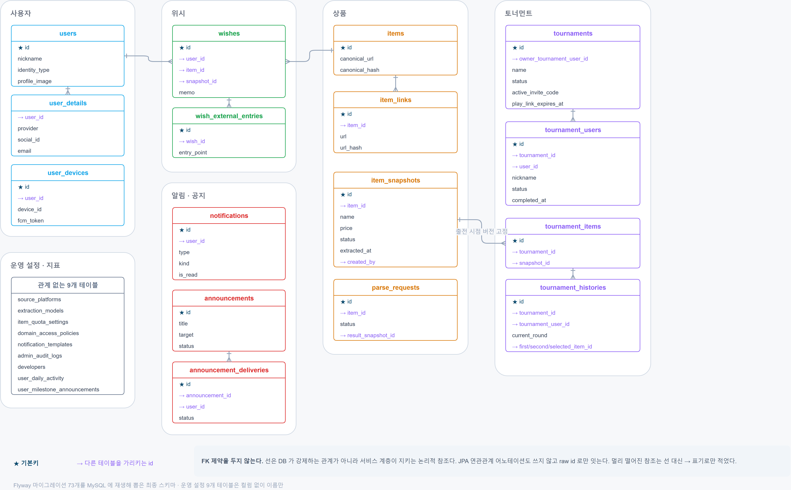
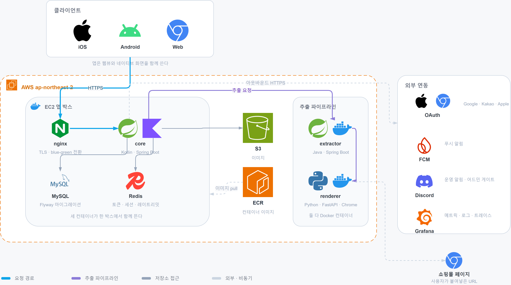
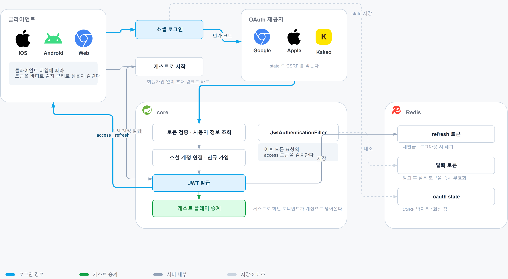
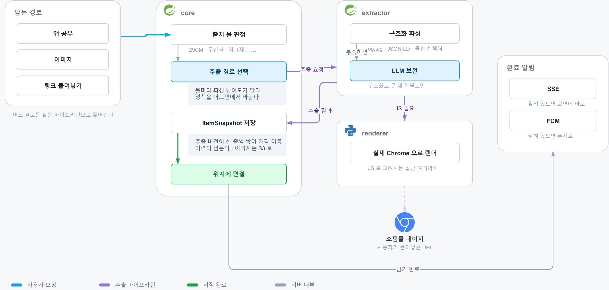
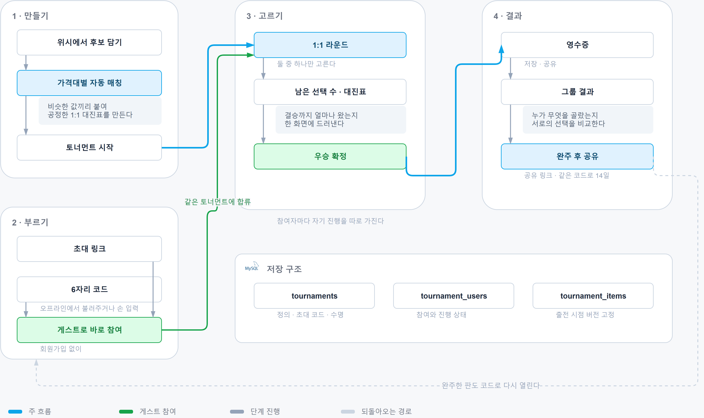
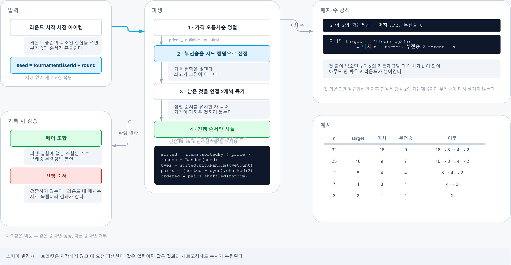
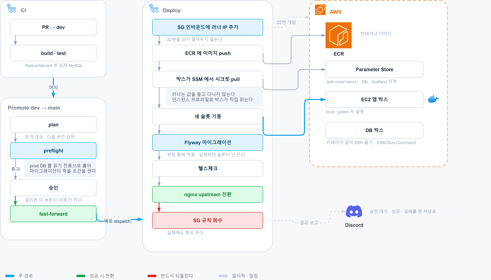

# PiKi · core

> **Saved a lot, bought nothing?**

쌓아둔 위시템을 토너먼트로 비교해 **직접 결정**하게 돕는 서비스, PiKi 의 백엔드 API 서버입니다.

위시리스트 · 토너먼트 · 사용자를 소유하고, 상품 추출 파이프라인을 오케스트레이션합니다.

<a href="https://apps.apple.com/kr/app/piki-%EA%B0%99%EC%9D%B4-%EA%B3%A0%EB%A5%B4%EB%8A%94-%EC%87%BC%ED%95%91-%ED%86%A0%EB%84%88%EB%A8%BC%ED%8A%B8/id6777101805">
  
</a>
<a href="https://play.google.com/store/apps/details?id=day.no30s.piki">
  
</a>


## 목차

1. [서비스 소개](#서비스-소개)
2. [주요 기능](#주요-기능)
3. [시스템 구성](#시스템-구성)
4. [기술 스택](#기술-스택)
5. [레포 구성](#레포-구성)
6. [데이터 모델](#데이터-모델)
7. [시스템 아키텍처](#시스템-아키텍처)
8. [인증](#인증)
9. [위시 등록과 상품 추출](#위시-등록과-상품-추출)
10. [토너먼트](#토너먼트)
11. [배포 자동화](#배포-자동화)
12. [백오피스](#백오피스)
13. [팀 소개](#팀-소개)

## 서비스 소개

**모아서.** 29CM · 무신사 · 지그재그 어디서 발견했든 원하는 상품을 한곳에 모읍니다. 링크를 붙여넣으면 상품명 · 가격 · 이미지가 자동으로 채워집니다.

**비교해서.** 모인 후보를 비슷한 가격대끼리 1:1 토너먼트로 붙입니다. 고민은 짧게, 선택은 둘 중 하나만. 라운드가 올라갈수록 취향이 선명해집니다.

**함께.** 친구를 초대해 같이 담고, 대신 골라주고, 모은 후보를 토너먼트째 선물합니다. 초대 링크 하나면 **회원가입 없이** 바로 참여할 수 있습니다.

## 주요 기능

### 1 · 위시템 가져오기

앱 공유 · 이미지 · 링크 세 경로로 상품을 담습니다. 어느 경로로 들어오든 서버는 동일한 추출 파이프라인으로 처리합니다.

| 앱 공유로 가져오기 | 이미지로 가져오기 | 링크로 가져오기 |
| :---: | :---: | :---: |
|  |  |  |

### 2 · 친구 초대하기

링크와 6자리 초대 코드로 친구를 초대합니다. 초대를 받은 사용자는 게스트로 즉시 참여하며, 이후 로그인 시 기존 플레이 기록이 정식 계정으로 승계됩니다.


### 3 · 토너먼트로 고르기

시작 전 담긴 후보를 비슷한 가격대끼리 자동 매칭하여 공정한 1:1 대진표를 구성합니다. 남은 선택 수와 대진표를 함께 제공하여 진행 상황을 직관적으로 보여줍니다.


### 4 · 결과 저장 및 공유하기

선택 결과를 영수증 형태로 저장하고 공유할 수 있습니다. 친구 역시 같은 토너먼트에 참여하여 서로의 선택을 비교할 수 있습니다.


## 시스템 구성

| 레포 | 역할 | 스택 |
|---|---|---|
| [client](https://github.com/TeamPiKi/client) | 앱 클라이언트 | iOS · Android · Web |
| **core** (본 레포) | 백엔드 API 서버 및 백오피스 | Kotlin · Spring Boot · MySQL · Redis |
| [extractor](https://github.com/TeamPiKi/extractor) | 상품 추출 서비스 (URL 페치, 구조화 파싱, LLM 보완) | Java · Spring Boot · Gemini |
| renderer <sup>private</sup> | JS 기반 페이지 브라우저 렌더링 | Python · FastAPI · Chrome |
| [infra](https://github.com/TeamPiKi/infra) | 공통 인프라 자산 SSOT (배포 블록, 개발 규약) | Bash · Protobuf |

**호출 흐름:** `client → core → extractor → renderer`

## 기술 스택

**Language & Framework**

<p>
  
  
  
  
</p>

**Database**

<p>
  
  
  
  
</p>

**Infra & Deploy**

<p>
  
  
  
  
  
</p>

**API · 알림 · 관측**

<p>
  
  
  
  
  
  
</p>

**Test**

<p>
  
  
  
</p>

## 레포 구성

### core

```
📦 com.depromeet.piki
 ┃
 ┣ 📂 auth ──────────────── OAuth · JWT · 게스트 · 토큰 저장소
 ┃  ┣ 📂 infrastructure
 ┃  ┃  ┣ 📂 google · kakao · apple
 ┃  ┃  ┗ 📂 redis ───────── refresh · withdrawn · oauth-state
 ┃  ┣ 📂 filter ─────────── JwtAuthenticationFilter
 ┃  ┗ 📂 web ────────────── 쿠키 · 클라이언트 타입
 ┃
 ┣ 📂 user ──────────────── 계정 · 프로필 · 탈퇴
 ┣ 📂 wishlist ──────────── 위시 담기 · 목록 · 정리
 ┣ 📂 item ──────────────── 상품 정체성과 버전(ItemSnapshot)
 ┣ 📂 product ───────────── 외부 상품 · 추출 파이프라인
 ┃  ┣ 📂 source ─────────── 출처 몰 판정
 ┃  ┗ 📂 routing ────────── 추출 경로 선택
 ┃
 ┣ 📂 tournament ────────── 대진 · 플레이 · 초대 · 결과
 ┃  ┣ 📂 event ──────────── 도메인 이벤트
 ┃  ┗ 📂 migration ──────── 데이터 이행 백필
 ┃
 ┣ 📂 notification ──────── 푸시 · 인앱 · SSE
 ┃  ┣ 📂 fcm
 ┃  ┗ 📂 sse
 ┃
 ┣ 📂 image ─────────────── 업로드 · presigned URL
 ┣ 📂 announcement ──────── 공지
 ┣ 📂 metrics ───────────── 활동 · 등록 · 마일스톤 · 리포트
 ┣ 📂 admin ─────────────── 백오피스 (Thymeleaf SSR)
 ┗ 📂 common ────────────── 응답 래퍼 · 예외 · 이벤트 · 레이트리밋 · 스토리지
```

- **도메인 용어 통일:** `item`은 상품의 고유 정체성을 의미하며, 추출값·상태·이력은 `ItemSnapshot`(버전)으로 관리합니다. `wish`는 사용자가 `item`을 담은 기록이며, `tournament_item`은 출전 시점의 버전을 고정하여 가리킵니다. 외부 경계를 가리키는 이름에는 `item`, 내부 엔티티에는 `product`를 사용합니다.
- **JPA 연관관계 제약 최소화:** 테이블 간 FK 제약과 JPA 연관관계 어노테이션을 배제했습니다. 관계는 Raw ID로만 유지하며, 참조 무결성은 서비스 계층에서 보장합니다.

### extractor

```
📦 com.depromeet.piki.extractor
 ┃
 ┣ 📂 api ───────────────── 추출 요청 · 모델 점검 엔드포인트 (core 전용)
 ┣ 📂 extraction ────────── URL 추출 파이프라인
 ┃  ┣ 📂 http ───────────── 페이지 fetch · 내부 주소 차단(SSRF)
 ┃  ┣ 📂 headless ───────── renderer 호출 · 응답 압축 해제
 ┃  ┣ 📂 structured ─────── JSON-LD · OpenGraph 파싱
 ┃  ┗ 📂 gemini ─────────── 구조화로 못 채운 필드만 LLM 보완
 ┃
 ┣ 📂 image ─────────────── 상품 이미지에서 추출 · 상품 영역 크롭
 ┣ 📂 probe ─────────────── LLM 모델 가용성 점검
 ┣ 📂 domain ────────────── ProductLink · ProductSnapshot
 ┗ 📂 common ────────────── 설정 · 예외 · S3 스토리지
```

### renderer 및 infra

- **renderer:** extractor가 전달한 URL을 실제 Chrome으로 렌더링하여 HTML을 반환합니다.
- **infra:** 배포 블록, 서비스 간 계약(Proto), 공통 규약을 관리합니다.

## 데이터 모델



- 스키마의 정본은 Flyway 마이그레이션입니다. ERD는 73개의 마이그레이션을 실제 MySQL에 순서대로 적용한 최종 상태를 기반으로 합니다.
- FK 제약이 없으므로 선은 DB가 강제하는 관계가 아닌 서비스 계층의 논리적 참조를 의미합니다.
- 운영 설정 관련 테이블(출처 몰, 추출 모델, 도메인 접근 정책 등)은 독립적으로 분리되어 있습니다.

## 시스템 아키텍처



클라이언트 요청은 API 서버(core)를 거쳐 비즈니스 로직을 처리하며, 상품 추출이 필요한 경우 extractor와 renderer 파이프라인을 비동기/동기로 호출합니다.

## 인증



- **지원 제공자:** Google, Kakao, Apple 및 게스트 로그인
- **토큰 관리:** Redis를 통해 재발급용 Refresh 토큰, 탈퇴 즉시 무효화를 위한 블랙리스트, CSRF 방지용 1회성 OAuth State를 관리합니다.
- **클라이언트 대응:** 클라이언트 타입에 따라 토큰을 응답 바디 또는 쿠키로 전달합니다.

## 위시 등록과 상품 추출



- **통합 파이프라인:** 앱 공유, 이미지, 링크 등 어떤 경로로 진입하든 동일한 파이프라인을 거칩니다. core가 출처 몰을 판정하고, extractor가 구조화 파싱을 수행한 뒤 부족한 필드를 LLM으로 보완합니다. JS 렌더링이 필요한 몰은 renderer를 경유합니다.
- **버전 관리:** 추출 결과는 덮어쓰지 않고 `ItemSnapshot` 형태로 이력을 누적하여 가격 및 이름 변경 추이를 기록합니다.
- **트랜잭션 분리:** 응답 속도 저하를 방지하기 위해 Read-timeout이 긴 외부 추출 API 호출은 DB 트랜잭션 범위 외부에 배치합니다.

## 토너먼트



- **자동 매칭:** 시작 전 후보들을 비슷한 가격대끼리 자동 매칭하여 공정한 1:1 대진표를 생성합니다.
- **독립적인 진행:** 토너먼트 정의(`tournaments`)와 사용자별 진행 상태(`tournament_users`)를 분리하여, 여러 사용자가 각자의 속도로 플레이할 수 있습니다.
- **대진표 미저장 설계:** 대진표는 별도 테이블에 저장하지 않고, 참여자 ID와 라운드 번호 기반의 Seed를 통해 매번 동일한 순서를 계산합니다. 이를 통해 스키마 복잡도를 낮추고 새로고침 시에도 순서를 완벽히 복원합니다.



## 배포 자동화



- **브랜치 전략:** `dev` 머지 시 자동 배포되며, prod는 `Promote` 워크플로를 통해 `dev` 커밋을 `main`으로 Fast-forward 승격합니다.
- **보안 및 시크릿:** 배포 시에만 러너 IP를 일시적으로 허용하며, 런타임 시크릿은 AWS SSM Parameter Store를 통해 인스턴스 프로파일로 직접 주입받습니다.
- **마이그레이션 안전장치:** Flyway 기반 앱 부팅 시 마이그레이션을 수행하며, 승격 전 프리플라이트 검증을 통해 장애 요인을 사전에 차단합니다.

## 백오피스

서버에서 Thymeleaf를 활용하여 운영 화면을 직접 서빙하며, 공지사항, 알림 템플릿, 추출 정책, 출처 몰, 아이템 쿼터, 디버그 로그 등을 관리합니다. 접근은 Discord 연동을 통한 IP Grant 인증 기반으로 통제됩니다.

## 팀 소개

<table>
  <thead>
    <tr>
      <th align="center" colspan="3">Backend</th>
    </tr>
  </thead>
  <tbody>
    <tr>
      <td align="center"></td>
      <td align="center"></td>
      <td align="center"></td>
    </tr>
    <tr>
      <td align="center"><b>박세빈</b></td>
      <td align="center"><b>조재중</b></td>
      <td align="center"><b>eunji</b></td>
    </tr>
    <tr>
      <td align="center"><a href="https://github.com/sevineleven">@sevineleven</a></td>
      <td align="center"><a href="https://github.com/m-a-king">@m-a-king</a></td>
      <td align="center"><a href="https://github.com/1o18z">@1o18z</a></td>
    </tr>
  </tbody>
</table>

<table>
  <thead>
    <tr>
      <th align="center" colspan="4">Client</th>
    </tr>
  </thead>
  <tbody>
    <tr>
      <td align="center"></td>
      <td align="center"></td>
      <td align="center"></td>
      <td align="center"></td>
    </tr>
    <tr>
      <td align="center"><b>정선아</b></td>
      <td align="center"><b>박소영</b></td>
      <td align="center"><b>강하은</b></td>
      <td align="center"><b>조영찬</b></td>
    </tr>
    <tr>
      <td align="center"><a href="https://github.com/iodio89">@iodio89</a></td>
      <td align="center"><a href="https://github.com/soyeong0115">@soyeong0115</a></td>
      <td align="center"><a href="https://github.com/kanghaeun">@kanghaeun</a></td>
      <td align="center"><a href="https://github.com/ychany">@ychany</a></td>
    </tr>
  </tbody>
</table>

<table>
  <thead>
    <tr>
      <th align="center" colspan="3">Design</th>
    </tr>
  </thead>
  <tbody>
    <tr>
      <td align="center"></td>
      <td align="center"></td>
      <td align="center"></td>
    </tr>
    <tr>
      <td align="center"><b>이예빈</b></td>
      <td align="center"><b>육예진</b></td>
      <td align="center"><b>정의연</b></td>
    </tr>
    <tr>
      <td align="center"><a href="https://www.behance.net/bad7ac99">Behance</a></td>
      <td align="center"><a href="https://www.behance.net/imyj980220af40">Behance</a></td>
      <td align="center"><a href="https://www.behance.net/euiyeonjeong">Behance</a></td>
    </tr>
  </tbody>
</table>
